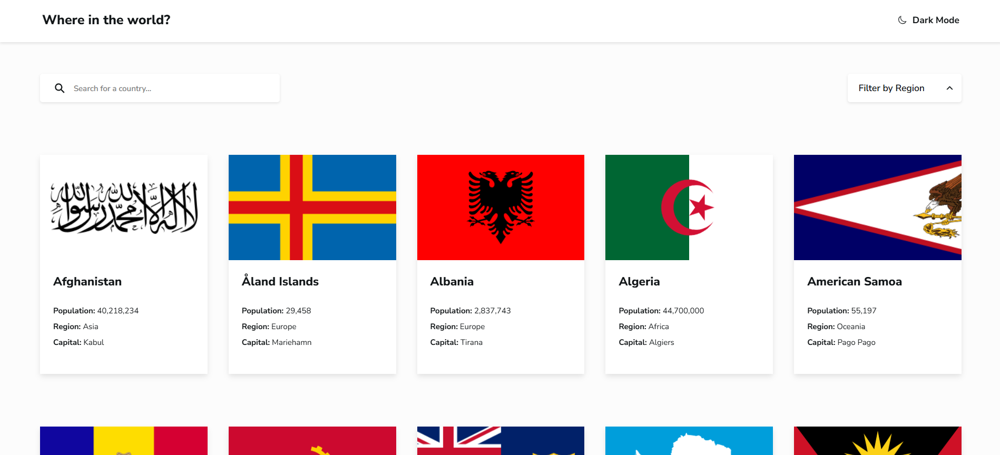

# 🌍 Country Explorer

A simple React website that displays a list of countries fetched from the REST Countries API. Users can:
  
- View all countries from the API on the homepage
- Search countries by name
- Filter countries by region
- View detailed information about each country
- Click back to return to the homepage
- Toggle dark/light mode

### Screenshot

### Links

- Solution URL: [Github Repository](https://github.com/rhodalewi/Country_Explorer)
- Live Site URL: [Live Demo](https://country-explorer-git-main-alewi-rhoda-oyinkanaols-projects.vercel.app/)

## Tech Stack

- [React](https://react.dev/)
- [React Router](https://reactrouter.com/)
- [React Icons](https://react-icons.github.io/react-icons/)
- CSS Flexbox and Grid
- REST Countries API

### What I learned

- How to fetch and manage external API data
- Route-based navigation and dynamic routes in React
- State management for filtering and searching
- Theming with a toggle hook and pure CSS
- Structuring and organizing reusable components
- Error handling and 404 routes

##  Continued development

In the future, I’d like to:

- Persist theme preference in localStorage
- Add search debounce optimization
- Add favorites/bookmarks feature

## Useful resources

- [Frontend Mentor REST Countries Challenge](https://www.frontendmentor.io/challenges/rest-countries-api-with-color-theme-switcher-UV8gP8cqb)
- [React Router Docs](https://reactrouter.com/en/main)
- [REST Countries API](https://restcountries.com/)

## 👤 Author

- Frontend Mentor – [@rhodalewi](https://www.frontendmentor.io/profile/rhodalewi)
- GitHub – [@rhodalewi](https://github.com/rhodalewi)
